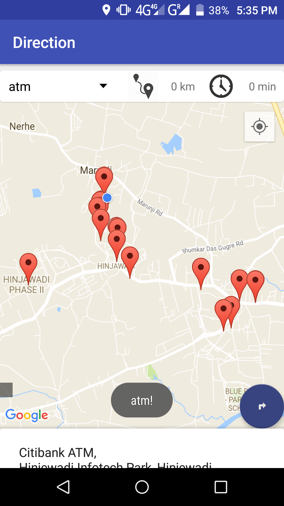
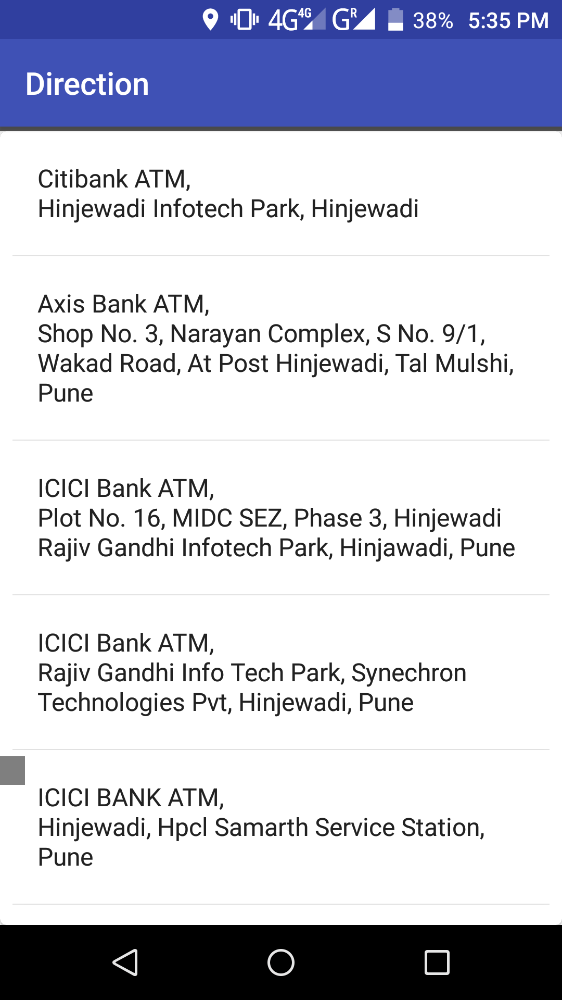
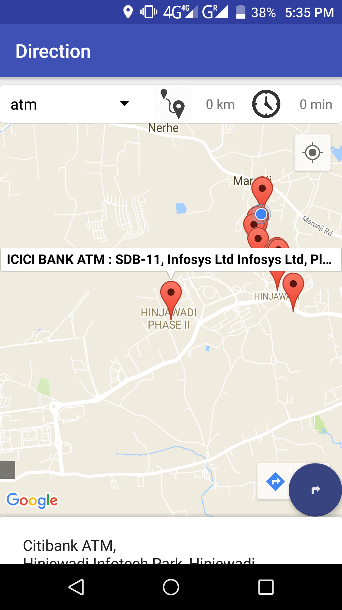
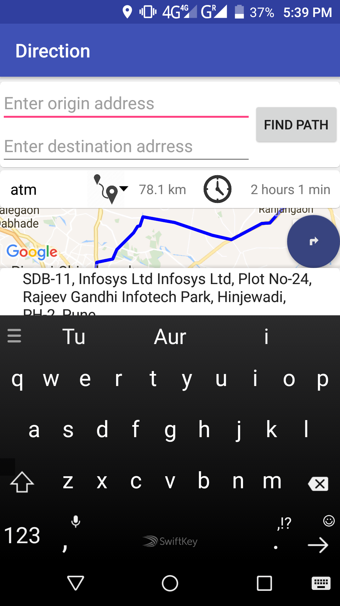
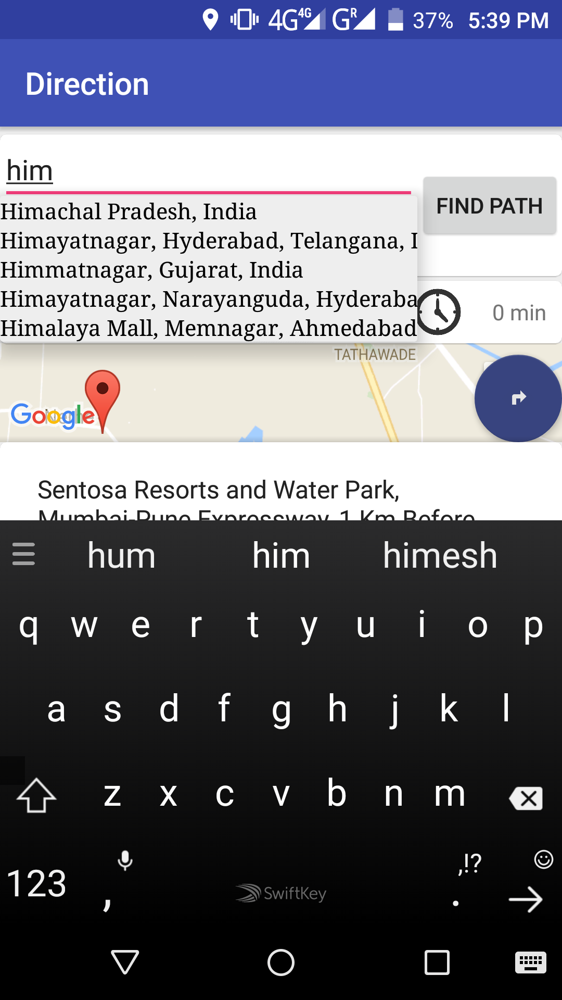
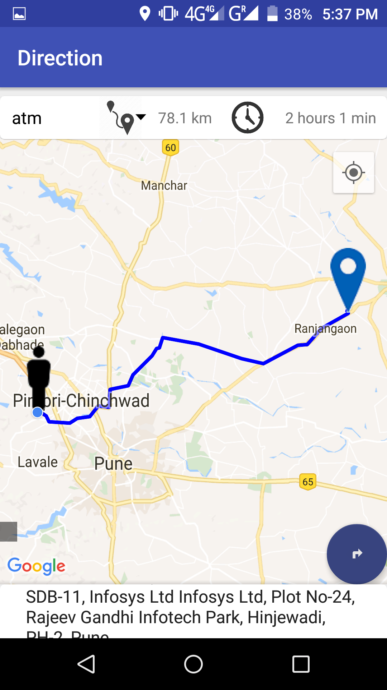

# GoogleDirectionPlaceAutoComplete
#itshareplus
#androidtutorialpoint
#github

This project is use to find nearby places in your locality in the radius of 5km.
you can search by the following categories
-monumnets
-restaurants
-atm
-bank
-hospital
-shopping mall
-park

and it also provide the navigation from your known location to the choosen destination
and it also provide you the feature to choose your source and destination to get the direction
but it only provides you the top view of the direction.
     
